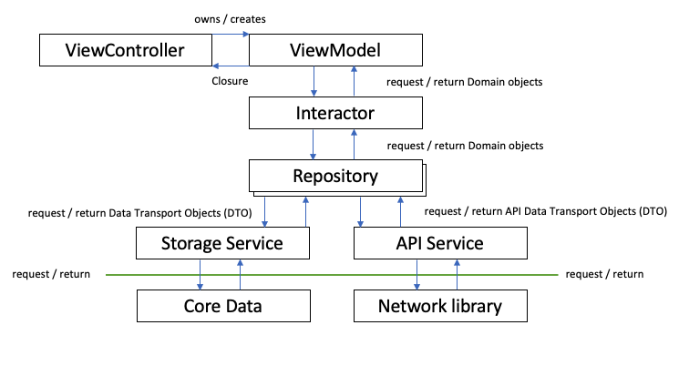

# An App Demo of a DI Container

This is an example application that uses the jsonplaceholder.typicode.com, in order to demonstrate how an MVVM-C architecture might be used with a dependency container.

 

## Installation
Download the files either from the command line, or download from GitHub's green button in the GUI interface. Dependencies are managed by Swift Package Manager, and can be reset in Xcode through `File> Swift Packages> Reset Package Caches`. More specifically, the **dependencies** I've used are my own `NetworkLibrary`

## Architecture
This particular implementation uses interactors and repositories

## Limitations
This App is intended to be an example of the architecture rather than a production ready application.
